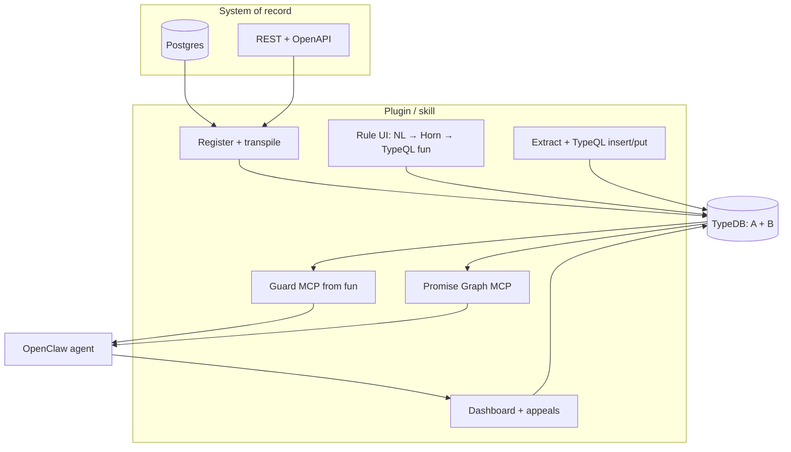
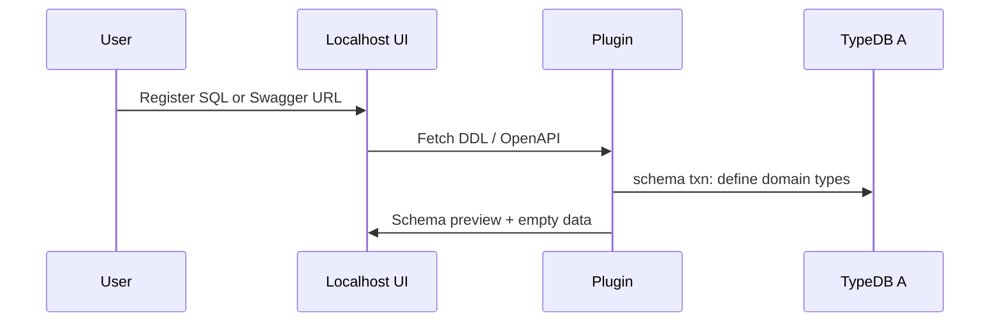
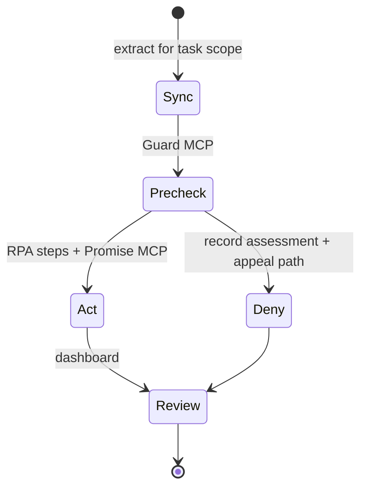

# OS-Agent RPA Guard Rails — OpenClaw Plugin / Skill (Implementation Plan)

**Source:** [`a_seed/os-agent-guard-rails-overview.md`](../../a_seed/os-agent-guard-rails-overview.md) **Deliverables § Stage 1.**  
**Concepts:** [`agent_book`](../../agent_book/) 00–05 (shadow TypeDB, PERA, `fun`, MCP, CWA/UNKNOWN); **TypeQL** TypeDB **3.8+** [`skills/typedb/SKILL.md`](../../skills/typedb/SKILL.md).  
**Promise graphs (normative):** [Promise graphs — manuscript `17-promise-graphs.md`](https://github.com/Volland/typedb-for-edge-ai-agents/blob/main/manuscript/17-promise-graphs.md).

---

## 1. Product summary (from overview)

Two **MCP surfaces** (can be one process with two tool namespaces):

1. **Guard / shadow MCP** — tools generated from **TypeQL `fun`** over **Layer A** (domain shadow: transpiled SQL or OpenAPI + synced facts). Agents call these **before** RPA side effects.
2. **Promise Graph MCP** — tools to **declare**, **chain**, **assess**, and **query** **promises**, **tasks**, **sessions**, **actions**, **assessments** per [`17-promise-graphs.md`](https://github.com/Volland/typedb-for-edge-ai-agents/blob/main/manuscript/17-promise-graphs.md) (**Layer B**). Enables “issue/vote on every Promise” and dashboard statistics.

**UI flows (overview § Basic Flow):** Register → transpile schema → **Rules** (NL left, Horn + diagram + **TypeQL viewer** tabs right) → append **`fun`** to schema → generate/sync extract → **dual MCP** → **Tasks** (schedule, run) → **Review** (dashboard, appeals, overrides) → optional **A/B** compare runs with vs without guard rails.

---

## 2. Two TypeDB layers

| Layer | Content | MCP role |
|-------|---------|----------|
| **A — Domain shadow** | Entities/relations/attributes from SQL or OpenAPI; **business-rule `fun`** | “May I do this step on this record?” |
| **B — Promise graph** | `agent`, `company`, `promise`, `assessment`, `action`, `session`, `shared-task`, `task-ownership`, `task-promise`, `promise-binding`, `promise-chain`, `assessment-binding`, `action-binding`, `result`, `data-trace`, … (`17-promise-graphs.md`) | “What was promised, assessed, broken, overridden?” |

Implementation may **start** with a **subset** of the manuscript (promise + binding + action + assessment + session + task + task-promise + promise-chain) and grow toward full schema.

---

## 3. Promise graph alignment (`17-promise-graphs.md`)

Adopt manuscript structure so examples in the book remain valid references:

- **Entities:** `agent`, `company`, `promise`, `assessment`, `action`, `decision`, `result`, `data-trace`, `session`, `reputation`, `context`, …  
- **Relations:** `promise-binding` (creator/target), `promise-chain`, `assessment-binding`, `action-binding`, `decision-binding`, `result-from-action`, `session-participation`, `task-ownership`, `task-promise`, `attestation`, …  
- **Patterns:** shared translation task example → map to **RPA task** with ordered promises and assessments.

**Mapping:** OpenClaw agent ↔ `agent`; user or “system” ↔ promise **target**; each **MCP guard check** ↔ logged **action** + link to **`data-trace`** (rule id, schema hash, sync watermark).

---

## 4. Architecture diagram

---

## 5. User journeys (diagrams)

### 5.1 Register → schema only

### 5.2 Rules composer (three tabs)

- **Logic viewer:** Horn IF/THEN/ELSE + diagram.  
- **TypeQL viewer:** generated `fun` (read-only or “propose diff”).  
- Background: **`redefine`** / append `fun` in **schema** txn; validate with skill rules (semicolon-terminated queries).

### 5.3 Task run

---

## 6. Implementation phases → GitHub issues

| # | Epic | Notes |
|---|------|--------|
| 0 | Dev env | WSL2 + Docker Desktop; TypeDB 3.8+ container; CI validate TypeQL |
| 1 | TypeDB service | Single or per-app DBs; connection config |
| 2 | Layer B minimal | `17-promise-graphs.md` subset + seed query tests |
| 3 | Register + SQL transpiler | Postgres → `define` + `@key` for stable ids |
| 4 | Register + OpenAPI transpiler | Components → entities/attributes; paths → extract bundles |
| 5 | Rule store + NL→Horn→`fun` | Persist AST; codegen; TypeQL tab |
| 6 | Sync worker | SQL/API → `write` txn inserts |
| 7 | **Guard MCP** | One tool per `fun` + introspection tools |
| 8 | **Promise Graph MCP** | Create/list/assess promises; link to task |
| 9 | OpenClaw skill package | Config, prompts, “always precheck” hooks |
| 10 | Dashboard | Runs, promise stats, appeals, override |
| 11 | A/B mode | Flag to run tasks without guard for comparison (overview §11) |

---

## 7. Testing (overview: “full testing approach”)

- **Unit:** transpilers, codegen, JSONPath mapping.  
- **TypeQL:** every `define`/`fun` in clean DB; MCP contract tests.  
- **Integration:** Docker compose: Postgres + API + TypeDB + plugin.  
- **E2E:** [`medical_app_scenario`](../medical_app_scenario/) and [`financial_planner_api_scenario`](../financial_planner_api_scenario/) SCENARIO docs as manual test scripts.  
- **Security:** secrets not in repo; least privilege on sync credentials.

---

## 8. Investor readiness

Cross-reference **DEMO.md** in each scenario folder for 1 / 5 / 20 minute scripts.

---

## 9. Stage 2 code paths (overview)

| Path | Purpose |
|------|---------|
| `code/medical_app_scenario` | Mini medical app |
| `code/financial_planner_api_scenario` | Financial API + UI |
| `code/rpa_plugin_skill` | OpenClaw plugin/skill |

This **PLAN.md** is documentation only until Stage 2.
