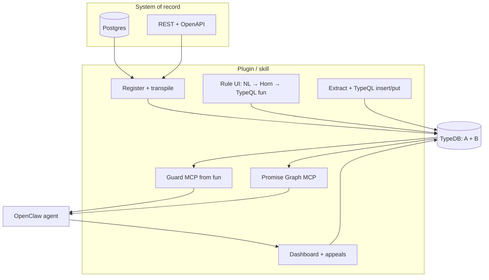
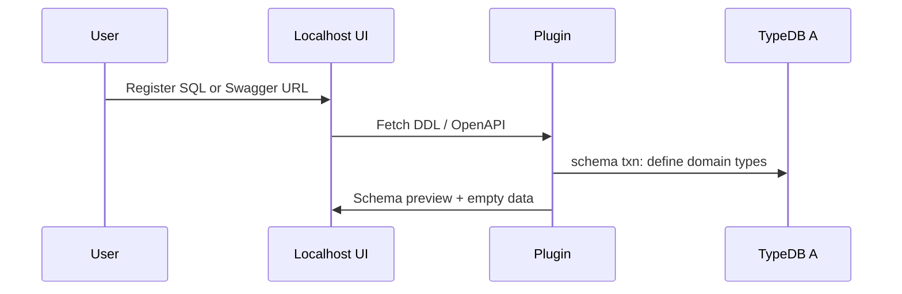
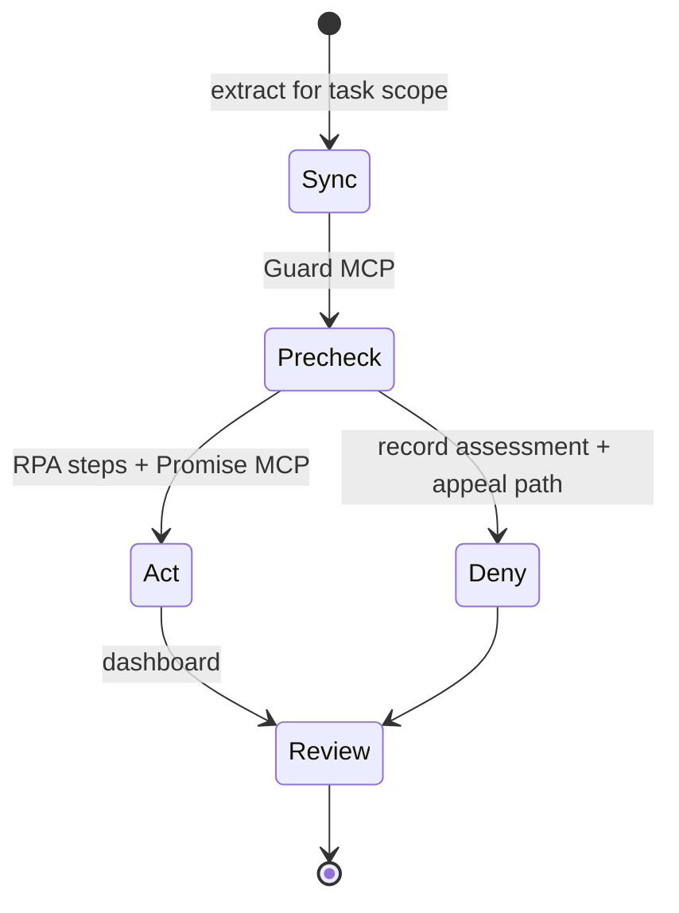

# OS-Agent RPA Guard Rails — OpenClaw Plugin / Skill (Implementation Plan)

**Source:** [`a_seed/os-agent-guard-rails-overview.md`](../../a_seed/os-agent-guard-rails-overview.md) **Deliverables § Stage 1.**  
**Concepts:** [`agent_book`](../../agent_book/) 00–05 (shadow TypeDB, PERA, `fun`, MCP, CWA/UNKNOWN); **TypeQL** TypeDB **3.8+** [`skills/typedb/SKILL.md`](../../skills/typedb/SKILL.md).  
**Promise graphs (normative):** [Promise graphs — manuscript `17-promise-graphs.md`](https://github.com/Volland/typedb-for-edge-ai-agents/blob/main/manuscript/17-promise-graphs.md).

---

## 1. Product summary (from overview)

OS-Agent RPA Guard Rails — OpenClaw Plugin / Skill enables users to register SQL databases and API's, setup rules against them, then setup and schedule tasks against them, with 100% tracking of the tasks and their outcomes.

The plugin/skill includes two **MCP surfaces** (can be one process with two tool namespaces) to support the operations:

1. **Guard / shadow MCP** — registering enables the schema for a  **Layer A**  shadow domain TypeDB to be generated from SQL or OpenAPI descriptions. Then the user uses rule composer to enter natural language rules, which are converted into **TypeQL `fun`** and inserted into **Layer A** (domain shadow: transpiled SQL or OpenAPI + rule functions). As new rules are added, the TypeDB regenerates the **MCP Layer A** to support the new rules, and the static Promises **MCP Layer B** is used to support the agent's ability to make decisions and actions, and to track the results of the tasks. Agents call this **Layer A MCP** **during** RPA to determine which records are valid to avoid side effects. The user can then define tasks in a task composer, which can then be scheduled to run once, at a specified date or time, or on a regular basis, and the results are tracked in the promise graph. In the background, as the tasks are defined, the task description is converted into SQL queries or API queries, and the data extracted from the sql or API is inserted into the  **Layer A** TypeDB, so it has the data to run the tasks before the scheduled time. The **MCP Layer A** and **MCP tasks** are used to support the agent's ability to make decisions and actions, and to track the results of the tasks. The **MCP Layer A** and **MCP Layer B** are used to support the agent's ability to make decisions and actions, and to track the results of the tasks.
2. **Promise Graph MCP** — tools for agent collaboration to **declare**, **chain**, **assess**, and **query** **promises**, **tasks**, **sessions**, **actions**, **assessments** per [`17-promise-graphs.md`](https://github.com/Volland/typedb-for-edge-ai-agents/blob/main/manuscript/17-promise-graphs.md) (**Layer B**). Enables “issue/vote on every Promise” and dashboard statistics. Creates the ability for every decision and action to be explained and audited. these form a static part of the MCP server that does not change as new rules are added.

**UI flows (overview § Basic Flow):** **Register** SQL or API → query and transpile schema into TypeDB Layer A schema → **Rule Composer** (NL left, Horn + diagram + **TypeQL viewer** tabs right) → append **`fun`** to Layer A schema → generate/sync extract → **dual MCP** → **Task Composer** → defining the task compared to the schema, makes it clear what data is required to execute the task, thus a sql/api query can be run to extract the data from sql or API, and insert it into the Layer A shadow database, **Task Scheduler** →  composed tasks can then be scheduled, run, and the results tracked in the promise graph → **Task Review** (dashboard, appeals, overrides) → optional **A/B** compare runs with vs without guard rails. All details needed for the plugin/skill and UI are saved in a Layer C TypeDB schema, which is used to provide state for the plugin/skill UI. The Layer C schema is used to provide the state for the plugin/skill UI, and to track the results of the tasks.

## 3. Promise graph alignment (`17-promise-graphs.md`)

Adopt manuscript structure so examples in the book remain valid references:

- **Entities:** `agent`, `company`, `promise`, `assessment`, `action`, `decision`, `result`, `data-trace`, `session`, `reputation`, `context`, …  
- **Relations:** `promise-binding` (creator/target), `promise-chain`, `assessment-binding`, `action-binding`, `decision-binding`, `result-from-action`, `session-participation`, `task-ownership`, `task-promise`, `attestation`, …  
- **Patterns:** shared translation task example → map to **RPA task** with ordered promises and assessments.

**Mapping:** OpenClaw agent ↔ `agent`; user or “system” ↔ promise **target**; each **MCP guard check** ↔ logged **action** + link to **`data-trace`** (rule id, schema hash, sync watermark).

---

## 4. Architecture diagram

```mermaid
flowchart TB
  subgraph SoR [System of record]
    PG[(Postgres)]
    API[REST + OpenAPI]
  end
  subgraph Plugin [Plugin / skill]
    REG[Register + transpile]
    RULES[Rule UI: NL → Horn → TypeQL fun]
    SYNC[Extract + TypeQL insert/put]
    M1[Guard MCP from fun]
    M2[Promise Graph MCP]
    DASH[Dashboard + appeals]
  end
  TDB[(TypeDB: A + B)]
  OC[OpenClaw agent]
  PG --> REG
  API --> REG
  REG --> TDB
  RULES --> TDB
  SYNC --> TDB
  TDB --> M1
  TDB --> M2
  M1 --> OC
  M2 --> OC
  OC --> DASH
  DASH --> TDB
```

---

## 5. User journeys (diagrams)

### 5.1 API/SQL Register → schema only (entering the API or SQL URL, plus a name for the API or SQL database, and the plugin/skill fetches the DDL or OpenAPI description, creates a TypeDB database with that name,and transposes it into a TypeDB Layer A schema. The user can have multiple API/SQL databases registered, and can switch between them to view the schema, rules, and tasks.)

```mermaid
sequenceDiagram
  participant U as User
  participant UI as Localhost UI
  participant P as Plugin
  participant A as TypeDB A
  U->>UI: Register SQL or Swagger URL
  UI->>P: Fetch DDL / OpenAPI
  P->>A: schema txn: define domain types
  P->>UI: Schema preview + empty data
```

### 5.2 Rule management: The user can manage the rules for the API/SQL database. The user can add new rules, edit existing rules, and delete rules. The rules are stored in the TypeDB Layer C schema.

### 5.3 Rules composer (entering natural language rules on the left, and two tabs on the right)

- **Logic viewer:** Horn IF/THEN/ELSE + diagram.  
- **TypeQL viewer:** generated `fun` (read-only or “propose diff”).  

In the background: **`redefine`** / append `fun` in **schema** txn; validate with skill rules (semicolon-terminated queries).

### 5.4 Task management: The user can manage the tasks for the API/SQL database. The user can add new tasks, edit existing tasks, and delete tasks. The tasks are stored in the TypeDB Layer C schema.

### 5.5 Task composer (entering the task description on the left, and on the right the task flow chart is displayed, the track composer is familiar with the schema and can highlight the object names and process logic in the flow chart. Once the task is defined, then in the background the task description is converted into SQL queries or API queries need to execute the task, and the results inserted into the Layer A shadow database. )

```mermaid
sequenceDiagram
  participant U as User
  participant UI as Localhost UI
  participant P as Plugin
  participant A as TypeDB A
  U->>UI: Enter task description (left pane)
  Note over UI: Right pane: flow chart of the task; task composer uses Layer A schema to highlight object names and process logic
  UI->>UI: Update flow chart as description changes
  U->>UI: Finalize task definition
  UI->>P: Persist task + request extract plan
  P->>P: Convert description to SQL or API queries
  P->>A: write txn: insert extracted rows into shadow (Layer A)
  P->>UI: Task ready to schedule; sync status / preview
  Note over P,UI: When scheduled and run, outcomes are tracked in the promise graph (Layer B / Promise Graph MCP)
```

### 5.6 Task Schedule and Run: The task can be scheduled to run immediately, or on a given date and time, or on a repeated basis. The task is then run, and the results tracked in the promise graph, and viewed in the Task Review dashboard.

```mermaid
stateDiagram-v2
  [*] --> Sync: extract for task scope
  Sync --> Precheck: Guard MCP
  Precheck --> Deny: record assessment + appeal path
  Precheck --> Act: RPA steps + Promise MCP
  Act --> Review: dashboard
  Deny --> Review
  Review --> [*]
```

### 5.7 Task Inspector: The task inspector dashboard displays the tasks that have been run, and the results of the tasks, including all of the promises that were made, and the assessments of the promises. The user can view all of the decision variables the agent used, and the exact decision it came to. The dashboard can be used to review the tasks, and to override the results of the tasks. The dashboard can also be used to appeal the results of the tasks.
---

### 5.6 Settings: The settings page allows the user to configure the plugin/skill, such as the TypeDB connection url of the server, and the task scheduler. The user can also configure the agent's name, and the agent's email address.
---

## 6. Testing (overview: “full testing approach”)

- **Unit:** transpilers, codegen, JSONPath mapping.  
- **TypeQL:** every `define`/`fun` in clean DB; MCP contract tests.  
- **Integration:** Docker compose: Postgres + API + TypeDB + plugin.  
- **E2E:** [`medical_app_scenario`](../medical_app_scenario/) and [`financial_planner_api_scenario`](../financial_planner_api_scenario/) SCENARIO docs as manual test scripts.  
- **Security:** secrets not in repo; least privilege on sync credentials.

---

## 7. Implementation phases → GitHub issues

| # | Epic | Notes |
|---|------|--------|
| 0 | Dev env | WSL2 + Docker Desktop; TypeDB 3.8+ container; CI validate TypeQL |
| 1 | TypeDB service | Single or per-app DBs; connection config |
| 2 | Layer B minimal | `17-promise-graphs.md` subset + seed query tests |
| 3 | Register + SQL transpiler | Postgres → `define` + `@key` for stable ids |
| 4 | Register + OpenAPI transpiler | Components → entities/attributes; paths → extract bundles |
| 5 | Rule store + NL→Horn→`fun` | Persist AST; codegen; TypeQL tab |
| 6 | Sync worker | SQL/API → `write` txn inserts |
| 7 | **Guard MCP** | One tool per `fun` + introspection tools |
| 8 | **Promise Graph MCP** | Create/list/assess promises; link to task |
| 9 | OpenClaw skill package | Config, prompts, “always precheck” hooks |
| 10 | Dashboard | Runs, promise stats, appeals, override |
| 11 | A/B mode | Flag to run tasks without guard for comparison (overview §11) |

## 8. Investor readiness

Cross-reference **DEMO.md** in each scenario folder for 1 / 5 / 20 minute scripts.

---

## 9. Stage 2 code paths (overview)

| Path | Purpose |
|------|---------|
| `code/medical_app_scenario` | Mini medical app |
| `code/financial_planner_api_scenario` | Financial API + UI |
| `code/rpa_plugin_skill` | this OS Agent RPA Guard Rails — OpenClaw plugin/skill |

This **PLAN.md** is initial documentation only .
